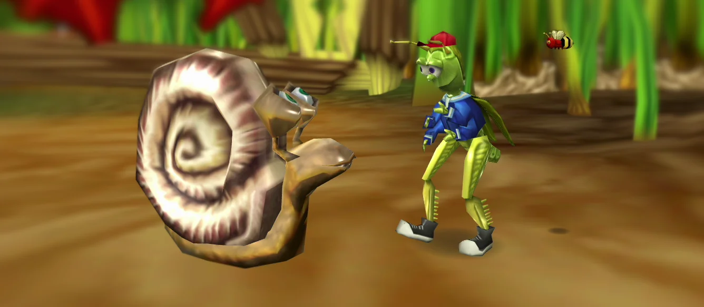

# Bugdom 2

This is a port of Pangea Software’s 2002 game **Bugdom 2** (the sequel to [Bugdom](https://github.com/jorio/Bugdom)) to modern operating systems, made under permission from Pangea Software, Inc.

**Download the game for macOS, Windows and Linux here:** https://github.com/jorio/Bugdom2/releases

## Documentation

- Original instruction manual:
  [English](Instructions/Instructions-EN.pdf) -
  [Dutch](Instructions/Instructions-NL.pdf) -
  [French](Instructions/Instructions-FR.pdf) -
  [German](Instructions/Instructions-DE.pdf) -
  [Italian](Instructions/Instructions-IT.pdf) -
  [Japanese](Instructions/Instructions-JA.pdf) -
  [Spanish](Instructions/Instructions-ES.pdf) -
  [Swedish](Instructions/Instructions-SV.pdf)
- [BUILD](BUILD.md) - How to build the game from source
- [CHANGELOG](CHANGELOG.md) - Bugdom 2 version history
- [LICENSE](LICENSE.md) (CC-BY-NC-SA 4.0)
- [SECRETS](SECRETS.md) - Cheat codes, etc.

## Legal info

Bugdom 2 © 2002 Pangea Software, Inc. Bugdom is a registered trademark of Pangea Software, Inc. This version was made and re-released here (https://github.com/jorio/Bugdom2) under permission from Pangea Software, Inc.

This version is licensed under [CC-BY-NC SA 4.0](LICENSE.md).

## More Pangea stuff!

Check out my ports of other Pangea classics:
- [Billy Frontier](https://github.com/jorio/BillyFrontier)
- [Bugdom 1](https://github.com/jorio/Bugdom)
- [Bugdom 2](https://github.com/jorio/Bugdom2)
- [Cro-Mag Rally](https://github.com/jorio/CroMagRally)
- [Mighty Mike (Power Pete)](https://github.com/jorio/MightyMike)
- [Nanosaur 1](https://github.com/jorio/Nanosaur)
- [Nanosaur 2](https://github.com/jorio/Nanosaur2)
- [Otto Matic](https://github.com/jorio/OttoMatic)

All ports are free of charge! If you’d like to support the development of Pangea game ports, feel free to visit https://jorio.itch.io and name your own price for any of the games there. Much appreciated! 😊
